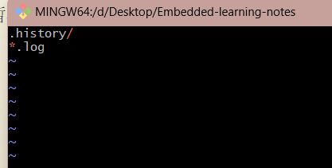

# 一、新建仓库

## 方法 1 --本地创建仓库

```c
git init
```

### 1. 创建一个文件夹

### 2. 使用 git init 命令把这个目录变成 Git 可以管理的仓库

](../Images/image.png)

会提示已经初始化一个空的仓库，即初始化成功，初始化成功后，当前目录会出现一个.git 目录,如图：  
](../Images/image-1.png)

> 还可以用命令 git init xxx 把指定目录初始化为仓库。

## 方法 2 --克隆远程仓库

```c
git clone 远程仓库地址
```

<br>
<br>

# 二、工作区域和文件状态

## 1.工作区（Working Directory）

所谓工作区就是你在电脑里能看到的目录，比如目录下 testgit 里的文件（.git 隐藏目录除外）。或者你通过 git clone 克隆下来的代码仓库也是工作区
<br>

## 2.暂存区（Stage/Index）

所谓暂存区就是一个文件，保存的是工作区某个版本的内容，也就是即将提交到远程仓库的文件。通过 git add 命令将工作区的修改保存到暂存区。
<br>

## 3.本地仓库（Local Repository）

本地仓库即 git 仓库，工作区有一个隐藏目录.git，这个不算工作区，而是 Git 的版本库。Git 的版本库里存了很多东西，其中最重要的就是称为 stage（或者叫 index）的暂存区，还有 Git 为我们自动创建的第一个分支 master，以及指向 master 的一个指针叫 HEAD。
<br>

## 使用过程

实际使用过程中，我们会在工作区对文件进行修改、新增、删除等操作，然后通过**git add** 命令将文件添加到暂存区，此时文件的状态为 Staged。在将文件添加到暂存区后，我们又可以通过**git commit**命令将文件提交到本地仓库。
<br>
也就是：**工作区->暂存区->本地仓库**

<br>

# 文件状态

|  文件状态  |                                                                解释                                                                 |
| :--------: | :---------------------------------------------------------------------------------------------------------------------------------: |
| Untracked  |                                       未跟踪，即新增的文件，这类文件在 Git 中默认没有任何状态                                       |
|  Tracked   |                            已跟踪，即已纳入版本控制的文件，这类文件的状态可以是未修改，已修改，已暂存。                             |
| Unmodified |       未修改，即 Working Directory 中的文件和 HEAD 文件库里最新版本完全一致，这类文件在执行 git diff 命令时不会显示任何内容。       |
|  Modified  | 已修改，即 Working Directory 中的文件和 HEAD 文件库里最新版本不一致，这类文件的修改未提交，每次执行 git diff 命令时会显示修改内容。 |
|   Staged   |               已暂存，即 Working Directory 中的文件和暂存区中的文件一致，这类文件由 git diff --cached 命令显示内容。                |
|  Commited  |                   已提交，即 Working Directory 中的文件和本地仓库中的文件一致，这类文件由 git diff 命令显示内容。                   |
|  Removed   |                                    已移除，即已被删除的文件，这类文件在 Git 中默认没有任何状态。                                    |

<br>

](../Images/%E6%96%87%E4%BB%B6%E7%8A%B6%E6%80%81.jpg)
